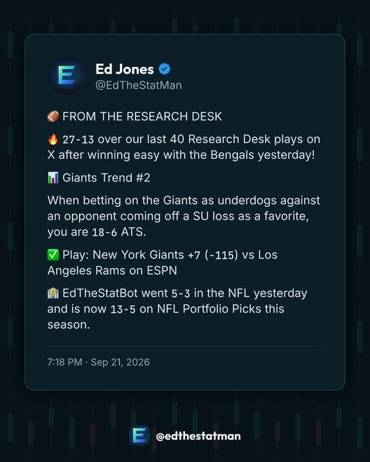
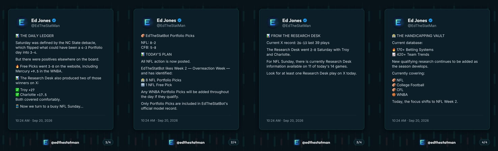
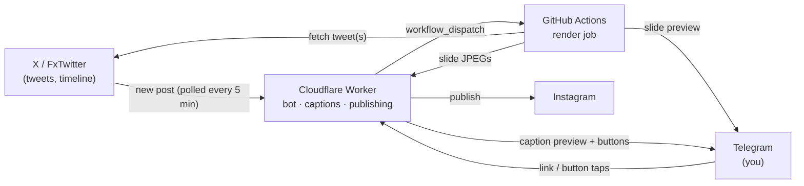

# statmanposterbot

**Turns [@EdTheStatMan](https://x.com/EdTheStatMan) tweets into branded Instagram posts, with one tap of approval in Telegram. Runs 24/7 on free tiers.**

<p align="center">
  
</p>

Posting research on X and then rebuilding it by hand for Instagram is a chore, so most of it never makes it across. This bot closes that gap:

1. **It spots new posts.** Every 5 minutes it checks @EdTheStatMan. New posts show up in Telegram with a **🎨 Build** button. (You can also paste any tweet link.)
2. **It designs the post.** The tweet is rendered as a 1080×1350 image in the EdTheStatMan design system. A thread becomes a carousel.
3. **It writes the caption.** AI rewrites the tweet for Instagram in the brand voice. A guardrail rejects any caption containing a number that isn't in the tweet.
4. **You approve it.** A preview arrives in Telegram with **✅ Post · ✏️ Edit caption · 🔄 New caption · ❌ Reject**.
5. **It publishes.** One tap posts to Instagram through the official API. If Instagram refuses, you get the files and caption to post by hand.

Nothing is posted without a human tapping ✅ Post.

<p align="center">
  
  <br><em>A 4-tweet thread becomes a 4-slide carousel, with the same card size and text size on every slide.</em>
</p>

## Features

- **Tweet cards in the brand's design system:** navy ground, candlestick texture, teal accents, Outfit/Inter type, and records and odds (`27-13`, `+7 (-115)`, `.700`) in JetBrains Mono. Text size is fitted by measuring the laid-out text.
- **Long-form tweets and threads.** Premium tweets get their full text. A thread is rebuilt from its last tweet into a carousel of up to 10 slides.
- **AI captions with guardrails.** Captions follow the brand voice: no hype, no guaranteed wins. Any caption containing a number that isn't in the tweet, or wording like "lock" or "guaranteed", is thrown out, retried once, then replaced by a template caption.
- **Watching for new posts.** Standalone posts and threads are detected. Threads wait until they've finished posting before being offered. Replies to other people and reposts are ignored.
- **Safe publishing.** Every post is approved by a person. A double tap or a Telegram retry can never post twice. The Instagram token refreshes itself.
- **Failures are never silent.** A stuck render, a failed token refresh or a timeline outage each sends a Telegram alert. A rejected post comes back as ready-to-post files.

## How it works



The work is split across two free platforms because rendering needs about 1.5 seconds of CPU per slide, and Cloudflare's free plan allows 10 ms per request. The always-on bot therefore lives on Cloudflare, and rendering runs on demand in GitHub Actions. See [docs/architecture.md](docs/architecture.md) for the full design and the reasons behind it.

## Cost: $0/month

| Piece | Service | Free allowance | Our usage |
|---|---|---|---|
| Bot, publishing, cron | Cloudflare Workers | 100k requests/day | a few hundred |
| Job state, token | Cloudflare D1 | 5M reads/day | tiny |
| Slide images | Cloudflare KV | 1,000 writes/day | 1 per slide |
| Captions | Cloudflare Workers AI | 10k neurons/day | ~100 captions/day |
| Rendering | GitHub Actions | unlimited on public repos | ~1 min per post |
| Tweets | X embed endpoint + FxTwitter | free, no key | one call per post, plus one timeline check every 5 min |
| Publishing | Instagram API with Instagram Login | 100 posts/day | a few per day |

No credit card is required anywhere. That's why slide images live in KV rather than R2, which requires a card.

## Using the bot

| You send | What happens |
|---|---|
| A tweet link | Builds a post. If the tweet ends a thread, you get the whole thread as a carousel |
| `/single <link>` | Builds just that tweet, even if it's part of a thread |
| `/watch on` · `/watch off` · `/watch` | Turns new-post notifications on or off, or shows their status |
| `/instagram` | Shows whether Instagram is connected and how long the token is valid |

Only the Telegram user IDs in `TELEGRAM_ALLOWED_USER_IDS` get a response. Everyone else is ignored.

More detail, including every button and what to do when something goes wrong, is in [docs/operations.md](docs/operations.md).

## Development

```bash
npm install
npm run preview -- https://x.com/EdTheStatMan/status/2102175703781224462   # render a tweet to out/
npm run preview -- --thread <url of a thread's last tweet>                  # render a carousel
npm run preview -- --samples                                                # offline edge cases
npm run typecheck                                                           # app + worker
```

To run the whole bot locally from your phone, with no deploy, see [Local development](docs/setup.md#local-development).

### Project layout

```
worker/index.ts          Cloudflare Worker: Telegram webhook, buttons, captions, publishing, cron
scripts/render-job.ts    Render job (GitHub Actions): fetch → render → JPEG → Telegram + Worker
src/render/              Tweet card design (Satori) and PNG rendering (resvg WASM)
src/tweet/               Tweet, thread and timeline fetching
src/caption.ts           AI caption prompt, guardrails and template fallback
src/voice.ts             Brand voice and banned phrases
src/instagram.ts         Instagram publishing and token refresh
src/telegram.ts          Minimal Telegram Bot API client
migrations/              D1 schema
brand.json               Colours, logo, emoji style, time zone, caption sign-off
.github/workflows/       The render workflow
```

## Documentation

- **[Setup](docs/setup.md):** deploy the whole system from scratch, including accounts, secrets and the Meta app.
- **[Operations](docs/operations.md):** day-to-day use, alerts, rotating tokens and troubleshooting.
- **[Architecture](docs/architecture.md):** how the pieces fit together and why they're built this way.
- **[Customisation](docs/customization.md):** branding, caption voice, the AI model and which account to watch.

## Known limitations

- **Unofficial tweet sources.** X's embed endpoint and FxTwitter are free but unofficial, and either could change. If watching fails, you'll get an alert and can still paste links.
- **Threads are built from their last tweet.** X's free endpoints only link a reply to its parent, never to its children.
- **Images only.** Video tweets aren't turned into Reels yet.
