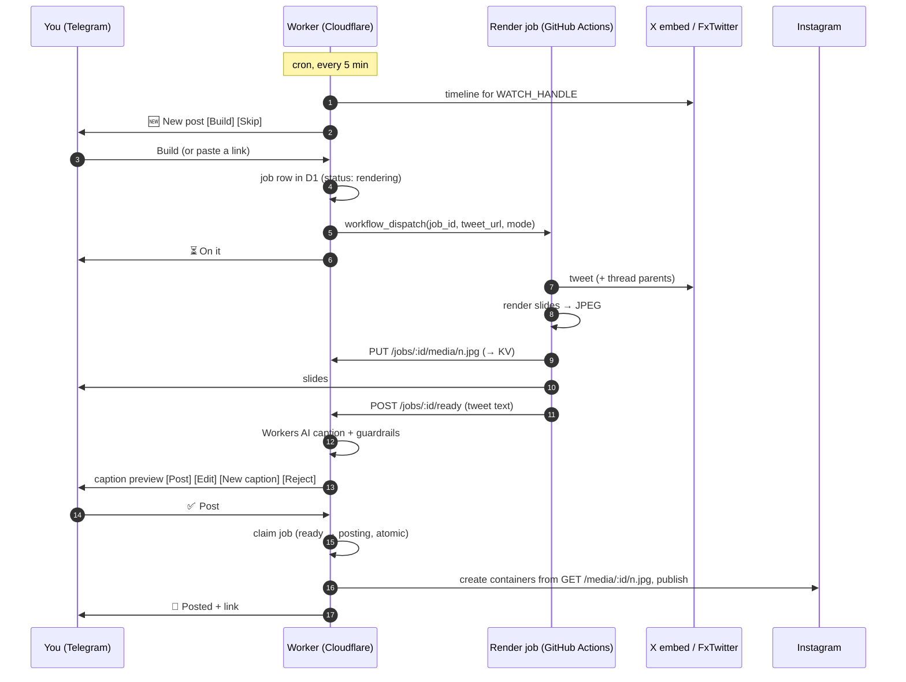

# Architecture

The system is two free-tier halves joined by HTTP:
- **An always-on Cloudflare Worker.** It's the bot and publisher: it talks to Telegram and Instagram, writes captions, stores state and runs a cron.
- **An on-demand GitHub Actions job.** It's the renderer: it fetches tweets and turns them into images.

## Why it's split this way

**Rendering can't run on the Worker.** Laying out a slide with Satori and rasterising it with resvg takes about 1.5 s of CPU. Cloudflare's free plan allows **10 ms of CPU per request**. GitHub Actions has no such limit and is free on public repos, so rendering runs there, at the cost of about 20–60 s of runner startup per post. That's fine, since a human reviews each post anyway.

**Everything else runs on the Worker.** Telegram, Instagram, Workers AI, D1 and KV calls are all network I/O, and waiting on the network doesn't count towards the CPU limit. The Worker stays well under 10 ms per request.

**The renderer is runtime-agnostic.** `src/render/` takes its fonts and resvg WASM as arguments (`src/platform/node.ts` loads them from disk), so the same code could run in a Worker on a paid plan.

## Components

### Worker (`worker/index.ts`)

| Route / trigger | Purpose |
|---|---|
| `POST /telegram` | Telegram webhook, checked against `X-Telegram-Bot-Api-Secret-Token`. Handles links, commands and button presses |
| `PUT /jobs/:id/media/:n.jpg` | The render job uploads slides (bearer `JOB_CALLBACK_SECRET`) → KV |
| `POST /jobs/:id/ready` · `/failed` | The render job reports back. On ready, the Worker writes the caption and sends the preview |
| `GET /media/:id/:n.jpg` | Serves slides publicly. Instagram fetches them from here when publishing |
| cron `*/5 * * * *` | Refreshes the Instagram token (weekly), polls the watched timeline, flags stuck renders, prunes old update ids |

### Render job (`scripts/render-job.ts`, `.github/workflows/render.yml`)

1. Fetches the tweet. In `auto` mode it walks the thread back to its first tweet (`src/tweet/thread.ts`).
2. Renders one slide per tweet (`src/render/`), all at one shared font size and card height.
3. Converts to JPEG with sharp, because Instagram's API only accepts JPEG.
4. Uploads the slides to the Worker, sends them to Telegram, and reports `ready` with the tweet text.

Workflow inputs go through `env:`, never interpolated into the script, so a crafted tweet URL can't inject shell commands.

## Data

| Store | Holds | Why this store |
|---|---|---|
| **D1** `jobs` | One row per post: status, caption, slide count, Instagram URL (JSON) | Must be strongly consistent (see below) |
| **D1** `caption_edits` | "Your next message is the new caption" state, 1 h expiry | Same |
| **D1** `settings` | Instagram token and its refresh time, watcher position (`watch_since_id`), on/off | Changes at runtime; secrets can't |
| **D1** `processed_updates` | Telegram update ids seen in the last 7 days | Makes Telegram's re-sends harmless |
| **KV** `media:<job>/<n>.jpg` | Slide images, 30-day expiry | Large binary values, written once. Free with no card, unlike R2 |

**Why job state moved from KV to D1.** KV is eventually consistent across Cloudflare locations. The render job reports `ready` from GitHub's US servers, while button presses arrive via Telegram's servers, often at a different Cloudflare location. For up to about 60 s that location could still see `rendering`, so buttons answered "Already rendering". D1 reads go to its primary and are always current. Images stay in KV because they're read minutes later, long after they've synced.

Job lifecycle: `rendering → ready → posting → posted`, or `rejected`, or `failed` when rendering fails. A failed publish goes back to `ready`, so it can be retried.

## Correctness guarantees

- **No double posts.** ✅ Post runs `UPDATE jobs SET status='posting' WHERE id=? AND status='ready'` and only publishes if exactly one row changed. A double tap, a second device or a retry all hit a no-op.
- **Telegram retries are harmless.** Updates are handled before the webhook answers, because publishing can outlast `waitUntil`'s time limit. If that makes Telegram time out and re-send, `processed_updates` makes the second delivery a no-op.
- **Captions can't invent numbers.** Every number in an AI caption must appear in the tweet. Captions with hype wording (`src/voice.ts`) are rejected too. The AI gets one retry, then the template caption is used. That's important for a betting brand, where a wrong record is misleading and a legal exposure.
- **Nothing is truncated silently.** A long-form tweet whose full text can't be fetched fails loudly instead of rendering cut off.
- **No silent failures.** A render that never reports back is flagged by the cron after 5 minutes. Token-refresh and timeline failures send alerts.

## External services

| Service | Used for | Official? |
|---|---|---|
| X embed endpoint (`cdn.syndication.twimg.com`) | Tweet data | Unofficial, powers embedded tweets |
| FxTwitter (`api.fxtwitter.com`) | Full text of long-form tweets, the account timeline for watching | Unofficial, community-run |
| Instagram API with Instagram Login (`graph.instagram.com`) | Publishing and token refresh | ✅ Official, no Facebook Page needed |
| Telegram Bot API | The interface | ✅ Official |
| Cloudflare Workers AI | Captions (`@cf/meta/llama-3.3-70b-instruct-fp8-fast`) | ✅ Official |
| jsDelivr | Apple / Twemoji emoji images for the cards | ✅ Public CDN |

**Why not the official X API?** On X's free tier you can post but not read, and reading costs money. The two unofficial sources are free and have been stable, and everything degrades gracefully: if watching fails you can paste links, and if a tweet can't be fetched the job fails with a clear message.

**Why not an unofficial Instagram login library?** Those log in with a password from server IPs, which Instagram flags. That risks the account and breaks Instagram's terms. The official API is free, and in development mode it needs no app review for accounts that have a role on the app.
